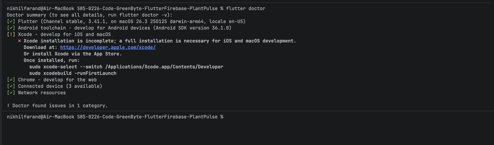

# 🌱 PlantPulse - Firebase Edition

> A Flutter-based cross-platform mobile application with Firebase authentication and real-time database integration for plant management.

---

## 📌 Project Overview

PlantPulse is a comprehensive Flutter application that demonstrates modern mobile app development with Firebase backend integration. This project showcases:

- **Firebase Authentication** - User signup, login, and session management
- **Cloud Firestore** - Real-time database for plant data storage
- **Reactive UI Development** - StreamBuilder for real-time updates
- **Cross-platform Compatibility** - Android, iOS, Web, and Desktop support
- **Material Design 3** - Modern, responsive UI components
- **Custom Reusable Widgets** - Modular UI components for consistent design

---

## 🎨 Custom Widgets Implementation

### Overview
PlantPulse features a comprehensive set of custom reusable widgets that demonstrate Flutter's widget composition capabilities. These widgets follow the DRY (Don't Repeat Yourself) principle and provide consistent UI across the application.

### 📦 Available Custom Widgets

#### 1. CustomButton (Stateless Widget)
A premium-styled button with loading states and customizable colors.

**Features:**
- Customizable label and colors
- Loading state with spinner
- Consistent premium styling
- Optional width and height parameters

**Usage:**
```dart
CustomButton(
  label: 'Sign In',
  onPressed: () => print('Button pressed'),
  isLoading: false,
  color: Color(0xFF1B5E20),
  width: double.infinity,
)
```

#### 2. PlantCard (Stateless Widget)
A reusable card component for displaying plant information with images and status indicators.

**Features:**
- Plant image display with fallback handling
- Health status badges
- Water schedule information
- Tap interactions
- Premium card design with shadows

**Usage:**
```dart
PlantCard(
  name: 'Monstera',
  type: 'Monstera Deliciosa',
  imageUrl: 'https://example.com/image.jpg',
  waterSchedule: '3 days',
  healthStatus: 'Healthy',
  onTap: () => print('Plant tapped'),
)
```

#### 3. StatCard (Stateless Widget)
A statistics card for displaying metrics with icons and optional navigation.

**Features:**
- Icon-based visual indicators
- Customizable colors
- Optional tap navigation
- Subtitle support
- Premium card design

**Usage:**
```dart
StatCard(
  title: 'Total Plants',
  value: '24',
  icon: Icons.eco,
  color: Colors.green,
  subtitle: 'Last 30 days',
  onTap: () => print('Stats tapped'),
)
```

#### 4. LikeButton (Stateful Widget)
An interactive like button with animations and state management.

**Features:**
- Animated like/unlike transitions
- Customizable colors and sizes
- State management with callbacks
- Elastic animation effects
- Visual feedback

**Usage:**
```dart
LikeButton(
  isLiked: _isLiked,
  onChanged: (liked) {
    setState(() => _isLiked = liked);
    // Handle like state change
  },
  size: 24,
  activeColor: Colors.red,
)
```

---

## 🚀 Firebase Features Implemented

### 🔐 Authentication System
- **Email/Password Signup** - Create new user accounts
- **Secure Login** - Authenticate existing users
- **Session Management** - Persistent login state
- **Auto-redirect** - Navigate based on authentication status

### 🗄️ Firestore Database
- **User Data Storage** - Store user profiles and preferences
- **Plant Management** - CRUD operations for plant records
- **Real-time Updates** - Live data synchronization
- **Data Validation** - Input validation and error handling

---

## 🏗️ Project Structure

```
lib/
├── main.dart                 # App entry point with Firebase initialization
├── screens/
│   ├── login_screen.dart     # User authentication interface
│   ├── signup_screen.dart    # New user registration
│   ├── dashboard_screen.dart # Main app interface with plant management
│   └── responsive_home.dart  # Original demo screen
├── services/
│   ├── firebase_service.dart # Authentication service layer
│   └── firestore_service.dart # Database service layer
└── widgets/
    └── custom_button.dart    # Reusable UI components
```

---

## 🌳 Widget Tree & Reactive UI Model

### Understanding the Widget Tree Concept

In Flutter, **everything is a widget** — text, buttons, containers, layouts, and even the app itself. Widgets are arranged in a **tree structure**, known as the widget tree, where each node represents a part of the UI. The root of the tree is usually the `MaterialApp` widget, followed by nested child widgets that form a hierarchical structure.

#### Widget Tree Hierarchy of PlantPulse App

When a user is logged in and viewing the Dashboard, the widget tree structure looks like this:

```
MaterialApp (Root Widget - StatefulWidget)
 ┣ ThemeData (Light Theme)
 ┣ ThemeData (Dark Theme)
 ┣ themeMode (Reactive - changes based on _isDarkMode state)
 ┗ AuthWrapper
    ┗ StreamBuilder<User?>
       ┗ DashboardScreen
          ┗ Scaffold
             ┣ AppBar
             │  ├── Text ('PlantPulse Dashboard')
             │  ┣ IconButton (Theme Toggle - Reactive)
             │  │  ┗ Icon (brightness_6)
             │  ┗ IconButton (Logout)
             │     ┗ Icon (logout)
             ┗ Body
                ┗ Padding
                   ┗ Column
                      ├── Container (Welcome Message)
                      │  ┗ Padding
                      │     ┗ Column
                      │        ├── Text ('Welcome back! 🌱')
                      │        ┗ Text ('Email: user@example.com')
                      │
                      ├── SizedBox (spacing)
                      │
                      ├── Text ('Add New Plant')
                      ├── SizedBox (spacing)
                      │
                      ├── TextField (Plant Name)
                      │  ┗ InputDecoration
                      │     ├── LabelText
                      │     ┗ PrefixIcon
                      │
                      ├── SizedBox (spacing)
                      │
                      ├── TextField (Plant Type)
                      │  ┗ InputDecoration
                      │     ├── LabelText
                      │     ┗ PrefixIcon
                      │
                      ├── SizedBox (spacing)
                      │
                      ├── ElevatedButton ('Add Plant')
                      │  ┗ Text
                      │
                      ├── SizedBox (spacing)
                      │
                      ├── Text ('My Plants')
                      ├── SizedBox (spacing)
                      │
                      ┗ Expanded
                         ┗ StreamBuilder<QuerySnapshot>
                            ┗ ListView.builder
                               ┗ Card (for each plant)
                                  ┗ ListTile
                                     ├── Leading: Icon
                                     ├── Title: Text (plant name)
                                     ├── Subtitle: Text (plant details)
                                     ┗ Trailing: IconButton (delete)
                                        ┗ Icon
```

### Exploring Flutter's Reactive UI Model

Flutter's UI is **reactive**, meaning that when data (state) changes, the framework automatically rebuilds the affected widgets. The UI is not manually redrawn; instead, Flutter efficiently re-renders only what needs updating.

#### How Reactive Updates Work in PlantPulse

**1. Theme Toggle Implementation**

In `PlantPulseApp` (StatefulWidget), we have:

```dart
class _PlantPulseAppState extends State<PlantPulseApp> {
  bool _isDarkMode = false;  // State variable

  void toggleTheme() {
    setState(() {
      _isDarkMode = !_isDarkMode;  // State changes here
    });
    // Flutter automatically rebuilds MaterialApp with new theme
  }
}
```

**2. Reactive Update Flow**

```
User clicks Theme Toggle IconButton
    ↓
toggleTheme() is called
    ↓
setState(() { _isDarkMode = !_isDarkMode; })
    ↓
Flutter marks MaterialApp as needing rebuild
    ↓
build() method is called
    ↓
MaterialApp rebuilds with new themeMode
    ↓
Entire widget tree re-evaluated
    ↓
Only widgets affected by theme change are updated
    ↓
UI smoothly transitions from light to dark mode (or vice versa)
```

**3. What Gets Rebuilt?**

When `setState()` is called:
- ✅ `MaterialApp` widget rebuilds (because it uses `_isDarkMode` in `themeMode`)
- ✅ All child widgets re-evaluate their build methods
- ✅ Widgets that depend on theme (colors, brightness) update automatically
- ✅ Flutter efficiently updates only what changed, not everything

### Why Flutter Rebuilds Only Parts of the Tree

Flutter uses a **diffing algorithm** to compare the new widget tree with the previous one:

1. **Widget Comparison**: Flutter compares widgets by their type and key, not by their values.

2. **Efficient Updates**: Only widgets that have changed (different type, key, or state) are rebuilt. Unchanged widgets are reused.

3. **Element Tree**: Flutter maintains an "element tree" that maps widgets to their rendered representation. When a widget changes, Flutter updates only the corresponding element.

4. **Performance Benefits**: This approach ensures that:
   - Only necessary widgets are rebuilt
   - Unchanged widgets maintain their state
   - The UI remains smooth and responsive
   - Memory usage is optimized

#### Example: Theme Toggle Performance

When you toggle the theme:
- **Before**: Light theme applied to entire app
- **Action**: Press theme toggle button
- **State Change**: `_isDarkMode` changes from `false` to `true`
- **Rebuild**: MaterialApp rebuilds with `themeMode: ThemeMode.dark`
- **Result**: All widgets automatically use dark theme colors
- **Performance**: Flutter doesn't recreate widgets, just updates their theme properties

### Key Concepts Demonstrated

1. **Widget Tree**: Every UI element is a widget arranged hierarchically
   - Root: `MaterialApp`
   - Branches: `Scaffold`, `AppBar`, `Column`, `Container`
   - Leaves: `Text`, `Icon`, `Button`

2. **Reactive Updates**: State changes trigger automatic UI rebuilds
   - `setState()` marks widget as dirty
   - Flutter rebuilds affected subtree
   - UI updates without manual intervention

3. **Efficient Rendering**: Only changed widgets are rebuilt
   - Flutter compares old and new widget trees
   - Updates only what's different
   - Maintains performance even with complex UIs

4. **State Management**: Proper use of `setState()` for local state
   - State variables hold current data
   - `setState()` triggers rebuilds
   - Callbacks pass state changes down the tree

### Screenshots Required

To demonstrate the reactive UI model, capture:

1. **Before Theme Toggle**: Screenshot showing the app in light mode
2. **After Theme Toggle**: Screenshot showing the app in dark mode

These screenshots prove that:
- The theme change is reactive (automatic)
- The entire UI updates smoothly
- Only necessary widgets rebuild

> **Note**: Add your screenshots to `assets/widget-tree-demo/` directory:
> - `before-theme-toggle.png` - Light mode
> - `after-theme-toggle.png` - Dark mode

---

## 🧭 Multi-Screen Navigation Implementation

### Navigation Overview

This version of PlantPulse demonstrates comprehensive multi-screen navigation using Flutter's Navigator and named routes system. The app showcases various navigation patterns essential for real-world applications.

### Navigation Architecture

#### Route Structure
```dart
// main.dart - Named Routes Configuration
initialRoute: '/',
routes: {
  '/': (context) => const AuthWrapper(),                    // Entry point
  '/login': (context) => const PremiumLoginScreen(),       // Authentication
  '/signup': (context) => const PremiumSignupScreen(),     // Registration
  '/home': (context) => HomeScreen(user: user),           // Main navigation hub
  '/dashboard': (context) => PremiumDashboardScreen(user: user), // Plant management
  '/profile': (context) => ProfileScreen(user: user),      // User profile
  '/about': (context) => const AboutScreen(),              // App information
  '/plant_demo': (context) => const PlantDemoScreen(),     // Data passing demo
}
```

#### Navigation Flow Chart
```
┌─────────────────┐
│   AuthWrapper   │ ← Firebase Auth State
└─────────┬───────┘
          │
    ┌─────▼─────┐
    │   Login   │ ← Not Authenticated
    └─────┬─────┘
          │
    ┌─────▼─────┐
│   HomeScreen   │ ← Authenticated (Main Hub)
└─────┬─────┬─────┘
      │     │
┌─────▼─┐ ┌─▼─────┐ ┌─────────┐
│Dashboard│ │Profile │ │ About   │
└────────┘ └────────┘ └─────────┘
```

### Navigation Methods Demonstrated

#### 1. Named Navigation with Arguments
```dart
// Navigate to dashboard with user data
Navigator.pushNamed(
  context, 
  '/dashboard',
  arguments: user,
);
```

#### 2. Data Passing Between Screens
```dart
// Navigate with complex data
Navigator.pushNamed(
  context, 
  '/plant_demo',
  arguments: {
    'plantName': 'Monstera',
    'plantType': 'Tropical',
    'wateringDays': 7,
  },
);

// Retrieve data in destination screen
final args = ModalRoute.of(context)!.settings.arguments as Map<String, dynamic>?;
final plantName = args?['plantName'] ?? 'Unknown Plant';
```

#### 3. Simple Navigation
```dart
// Navigate without data
Navigator.pushNamed(context, '/about');
```

#### 4. Navigation Stack Management
```dart
// Go back to previous screen
Navigator.pop(context);

// Go back multiple screens
Navigator.pop(context);
Navigator.pop(context); // Back to home
```

### Screen Descriptions

#### 1. HomeScreen (Navigation Hub)
- **Purpose**: Central navigation point for authenticated users
- **Features**: 
  - Welcome message with user information
  - Navigation cards to all major screens
  - Visual demonstration of navigation methods
  - Premium Material Design 3 UI

#### 2. AboutScreen
- **Purpose**: App information and technology stack
- **Features**:
  - App version information
  - Technology stack details
  - Navigation demo explanation
  - Back navigation demonstration

#### 3. ProfileScreen
- **Purpose**: User profile and plant statistics
- **Features**:
  - User information display
  - Plant count from Firestore
  - Logout functionality
  - Data passing from HomeScreen

#### 4. PlantDemoScreen
- **Purpose**: Demonstrate data passing between screens
- **Features**:
  - Receives plant data from HomeScreen
  - Displays passed arguments
  - Multiple navigation options (Back, Home)
  - Care instructions based on passed data

### Navigation Benefits in Production Apps

#### 1. **Scalability**
- Easy to add new screens without modifying existing navigation logic
- Centralized route management in `main.dart`
- Consistent navigation patterns across the app

#### 2. **Maintainability**
- Clear separation of navigation logic
- Type-safe data passing with proper null safety
- Easy to debug and modify navigation flows

#### 3. **User Experience**
- Smooth transitions between screens
- Proper back stack management
- Consistent navigation behavior

#### 4. **Development Efficiency**
- Reusable navigation patterns
- Easy to test individual screens
- Clear navigation flow documentation

### Code Examples

#### HomeScreen Navigation Implementation
```dart
class HomeScreen extends StatelessWidget {
  final User user;
  
  const HomeScreen({super.key, required this.user});

  @override
  Widget build(BuildContext context) {
    return Scaffold(
      body: Column(
        children: [
          // Navigation Cards
          _NavigationCard(
            icon: Icons.dashboard,
            title: 'Dashboard',
            subtitle: 'Plant management',
            onTap: () {
              Navigator.pushNamed(
                context, 
                '/dashboard',
                arguments: user,  // Pass user data
              );
            },
          ),
          // More navigation cards...
        ],
      ),
    );
  }
}
```

#### Data Receiving in PlantDemoScreen
```dart
class PlantDemoScreen extends StatelessWidget {
  @override
  Widget build(BuildContext context) {
    // Get arguments from previous screen
    final args = ModalRoute.of(context)!.settings.arguments as Map<String, dynamic>?;
    
    final plantName = args?['plantName'] ?? 'Unknown Plant';
    final plantType = args?['plantType'] ?? 'Unknown Type';
    final wateringDays = args?['wateringDays'] ?? 7;

    return Scaffold(
      body: Column(
        children: [
          Text('Plant: $plantName'),
          Text('Type: $plantType'),
          Text('Water every $wateringDays days'),
        ],
      ),
    );
  }
}
```

### Testing Navigation

#### Manual Testing Checklist
1. **Login Flow**: Login → HomeScreen appears
2. **Dashboard Navigation**: Home → Dashboard (with user data)
3. **Profile Navigation**: Home → Profile (with user data)
4. **About Navigation**: Home → About (no data needed)
5. **Plant Demo**: Home → Plant Demo (with plant data)
6. **Back Navigation**: All screens should properly navigate back
7. **Data Passing**: Verify data appears correctly in destination screens

#### Navigation Screenshots Required

1. **HomeScreen**: Main navigation hub with all options
2. **Dashboard**: Plant management screen with user data
3. **Profile**: User profile with plant statistics
4. **About**: App information screen
5. **Plant Demo**: Data passing demonstration
6. **Navigation Flow**: Series showing transitions between screens

> **Note**: Add navigation screenshots to `assets/navigation-demo/` directory:
> - `home-screen.png` - Main navigation hub
> - `dashboard-screen.png` - Plant management
> - `profile-screen.png` - User profile
> - `about-screen.png` - App information
> - `plant-demo-screen.png` - Data passing demo
> - `navigation-flow-1.png` - Home to Dashboard
> - `navigation-flow-2.png` - Dashboard back to Home

---

## 🔧 Firebase Integration Setup

### 1. Dependencies
```yaml
dependencies:
  firebase_core: ^3.0.0
  firebase_auth: ^5.0.0
  cloud_firestore: ^5.0.0
```

### 2. Firebase Initialization
```dart
void main() async {
  WidgetsFlutterBinding.ensureInitialized();
  await Firebase.initializeApp();
  runApp(const PlantPulseApp());
}
```

### 3. Authentication Service
```dart
class AuthService {
  final FirebaseAuth _auth = FirebaseAuth.instance;

  Future<User?> signUp(String email, String password) async {
    try {
      final credential = await _auth.createUserWithEmailAndPassword(
        email: email,
        password: password,
      );
      return credential.user;
    } catch (e) {
      print('Sign up error: $e');
      return null;
    }
  }

  Future<User?> signIn(String email, String password) async {
    try {
      final credential = await _auth.signInWithEmailAndPassword(
        email: email,
        password: password,
      );
      return credential.user;
    } catch (e) {
      print('Sign in error: $e');
      return null;
    }
  }

  Stream<User?> get authStateChanges => _auth.authStateChanges();
}
```

### 4. Firestore Service
```dart
class FirestoreService {
  final FirebaseFirestore _firestore = FirebaseFirestore.instance;

  Future<void> addPlantData(String uid, Map<String, dynamic> plantData) async {
    await _firestore.collection('users').doc(uid).collection('plants').add(plantData);
  }

  Stream<QuerySnapshot> getUserPlants(String uid) {
    return _firestore.collection('users').doc(uid).collection('plants').snapshots();
  }

  Future<void> deletePlantData(String uid, String plantId) async {
    await _firestore.collection('users').doc(uid).collection('plants').doc(plantId).delete();
  }
}
```

---

## 🎯 Key Features

### Authentication Flow
1. **Login Screen** - Email/password authentication
2. **Signup Screen** - New user registration with validation
3. **Auth Wrapper** - Automatic navigation based on auth state
4. **Session Persistence** - Users stay logged in across app restarts

### Plant Management Dashboard
- **Real-time Plant List** - Live updates using StreamBuilder
- **Add New Plants** - Form validation and database insertion
- **Delete Plants** - Remove plants with confirmation
- **User Welcome** - Personalized dashboard with user info

### Data Structure
```javascript
users/{userId}/
├── {userDocument}           // User profile data
└── plants/
    ├── {plantId1}           // Individual plant records
    │   ├── name: "Monstera"
    │   ├── type: "Tropical"
    │   ├── createdAt: "2024-01-15T10:30:00Z"
    │   └── lastWatered: "2024-01-15T10:30:00Z"
    └── {plantId2}
```

---

## 🚀 How to Run the Project

### Prerequisites
1. **Flutter SDK** - Install Flutter and add to PATH
2. **Firebase Project** - Create project in Firebase Console
3. **Firebase Configuration** - Download config files:
   - `google-services.json` → `android/app/`
   - `GoogleService-Info.plist` → `ios/Runner/`

### Setup Steps

1. **Clone the Repository**
```bash
git clone <repository-url>
cd plantpulse
```

2. **Install Dependencies**
```bash
flutter pub get
```

3. **Firebase Configuration**
```bash
# Install FlutterFire CLI
dart pub global activate flutterfire_cli

# Configure Firebase for your project
flutterfire configure
```

4. **Run the Application**
```bash
# For development
flutter run

# For web
flutter run -d web

# For Android
flutter run -d android

# For iOS
flutter run -d ios
```

---

## 📱 Application Screens

### 1. Login Screen
- Email and password input fields
- Form validation
- Navigation to signup screen
- Authentication error handling

### 2. Signup Screen
- User registration form
- Password strength validation
- Success feedback
- Redirect to login after registration

### 3. Dashboard Screen
- User welcome message
- Real-time plant list display
- Add new plant functionality
- Delete plant capability
- **Theme toggle button** (demonstrates reactive UI)
- Logout functionality

---

## 🔍 Testing Guide

### Authentication Testing
1. **Create New User**
   - Navigate to signup screen
   - Enter valid email and password (min 6 characters)
   - Verify successful account creation
   - Check Firebase Console → Authentication

2. **Login Testing**
   - Use created credentials to login
   - Verify dashboard access
   - Test invalid credentials error handling

3. **Session Persistence**
   - Close and reopen app
   - Verify user remains logged in
   - Test logout functionality

### Firestore Testing
1. **Add Plant Data**
   - Fill plant name and type fields
   - Submit form
   - Verify data appears in real-time list
   - Check Firebase Console → Firestore Database

2. **Real-time Updates**
   - Open app on multiple devices/simulators
   - Add plant on one device
   - Verify instant update on other devices

3. **Delete Operations**
   - Delete plant from list
   - Verify removal from UI and database

---

## 🛠️ Development Challenges & Solutions

### Challenge 1: Firebase Configuration
**Problem**: Initial setup complexity with multiple platform configuration files
**Solution**: Used FlutterFire CLI for automated configuration and provided setup documentation

### Challenge 2: Real-time Data Synchronization
**Problem**: Managing real-time updates without excessive rebuilds
**Solution**: Implemented StreamBuilder with proper error handling and loading states

### Challenge 3: Authentication State Management
**Problem**: Handling user session persistence and navigation
**Solution**: Created AuthWrapper widget with StreamBuilder for automatic state-based navigation

### Challenge 4: Form Validation
**Problem**: Providing user-friendly error messages for various input scenarios
**Solution**: Implemented comprehensive form validation with specific error messages

---

## 🌟 Firebase Benefits for Scalability

### Real-time Collaboration
- **Instant Updates**: All connected users see changes immediately
- **Offline Support**: Data syncs when connection is restored
- **Conflict Resolution**: Firebase handles concurrent modifications

### Scalability Advantages
- **Auto-scaling**: Database grows with user base automatically
- **Global CDN**: Fast data access worldwide
- **Security Rules**: Granular access control at database level
- **Built-in Analytics**: User behavior tracking without additional setup

### Cost Efficiency
- **Pay-per-use**: Only pay for resources consumed
- **Free Tier**: Generous free tier for development and small apps
- **No Server Management**: Focus on app development, not infrastructure

---


## 📸 Setup Verification Screenshots

### Flutter Doctor Output


### Running App on Emulator


## 👥 Team Members

- **Madhav Garg**
- **Rudar**
- **Nikhil**

---

## 🔮 Future Enhancements

- **Push Notifications** - Plant care reminders
- **Image Upload** - Plant photo gallery
- **Social Features** - Share plants with community
- **Analytics Dashboard** - Plant growth tracking
- **Multi-language Support** - Internationalization

---

## 📞 Support

For issues, questions, or contributions:
1. Check existing documentation
2. Review Firebase Console for configuration issues
3. Test with different network conditions
4. Validate Firebase security rules

---

*This project demonstrates the power of combining Flutter's reactive UI with Firebase's real-time backend capabilities for creating modern, scalable mobile applications.*

---

# Project Title
Responsive Layout Design Using Rows, Columns, and Containers

## Overview
This assignment adds a new `ResponsiveLayout` screen to the existing Flutter + Firebase PlantPulse application.
The screen demonstrates how to build a responsive user interface using `Container`, `Column`, `Row`, `Expanded`, `SizedBox`, and `MediaQuery`.
When the screen width is less than 600 pixels, the layout stacks content vertically for phone-sized devices.
When the screen width is 600 pixels or greater, the same content is displayed side-by-side using a horizontal row for tablet and larger displays.

## Layout Structure

The layout follows this widget tree:

- `Scaffold`
  - `AppBar`
  - `Container` (padding: 16)
    - `Column`
      - `Header Container`
      - `SizedBox` (vertical spacing)
      - `Expanded`
        - `SingleChildScrollView`
          - **Responsive Content Section**
            - If `screenWidth < 600`:
              - `Column`
                - `Content Section A` (`Container`)
                - `SizedBox` (vertical spacing)
                - `Content Section B` (`Container`)
            - If `screenWidth >= 600`:
              - `Row`
                - `Expanded` → `Content Section A` (`Container`)
                - `SizedBox` (horizontal spacing)
                - `Expanded` → `Content Section B` (`Container`)

This structure ensures that:
- The header always appears at the top.
- The content sections adapt between vertical and horizontal layouts.
- `Expanded` is used to avoid overflow and to let sections grow into available space.
- `MediaQuery` drives the breakpoint at 600 logical pixels of width.

## Code Snippets

### Container

```dart
Container(
  padding: const EdgeInsets.all(16),
  decoration: BoxDecoration(
    color: Colors.white,
    borderRadius: BorderRadius.circular(16),
  ),
  child: Column(
    crossAxisAlignment: CrossAxisAlignment.start,
    children: [
      Text('Section A'),
      const SizedBox(height: 8),
      Text('This section is inside a Container with padding and rounded corners.'),
    ],
  ),
);
```

### Column

```dart
Column(
  crossAxisAlignment: CrossAxisAlignment.stretch,
  children: [
    _buildHeader(context, isSmallScreen),
    const SizedBox(height: 16),
    Expanded(
      child: SingleChildScrollView(
        child: _buildResponsiveContent(context, isSmallScreen),
      ),
    ),
  ],
);
```

### Row and Expanded

```dart
Row(
  crossAxisAlignment: CrossAxisAlignment.start,
  children: [
    Expanded(
      child: _buildContentSection(
        context,
        title: 'Section A',
        description: 'Displayed on the left on larger screens.',
        icon: Icons.spa_outlined,
        theme: theme,
      ),
    ),
    const SizedBox(width: 16),
    Expanded(
      child: _buildContentSection(
        context,
        title: 'Section B',
        description: 'Displayed on the right on larger screens.',
        icon: Icons.eco_outlined,
        theme: theme,
      ),
    ),
  ],
);
```

### MediaQuery

```dart
@override
Widget build(BuildContext context) {
  final size = MediaQuery.of(context).size;
  final bool isSmallScreen = size.width < 600;

  return Scaffold(
    appBar: AppBar(
      title: const Text('Responsive Layout Demo'),
    ),
    body: Container(
      padding: const EdgeInsets.all(16),
      child: Column(
        children: [
          _buildHeader(context, isSmallScreen),
          // The rest of the responsive content...
        ],
      ),
    ),
  );
}
```

## Screenshots

- Small screen (phone) screenshot: `assets/screenshots/responsive_small.png` (placeholder)
- Large screen (tablet) screenshot: `assets/screenshots/responsive_large.png` (placeholder)

> Replace the above paths with your actual screenshot file locations once captured.

## Reflection

**Why is responsiveness important?**  
Responsiveness ensures that the same Flutter UI works across many devices and orientations without rewriting layouts for each case.
A responsive design improves usability, readability, and accessibility by adapting the placement and size of widgets to the available screen space.

**Challenges faced?**  
The main challenge was managing layout changes between vertical (Column) and horizontal (Row) configurations while avoiding overflow errors.
Choosing the right breakpoint (600 pixels in this assignment) and testing on different emulators was important to verify that the layout felt natural on both phones and tablets.
Another challenge was balancing visual design (padding, spacing, and shadows) with flexibility so that no hard-coded sizes would break the UI on extreme aspect ratios.

**Improvements for orientation support?**  
Orientation support can be improved by additionally checking `MediaQuery.of(context).orientation` and adjusting padding, font size, or the number of visible sections.
For example, in landscape mode on a phone, we could still use a horizontal `Row` even if the width is just under 600, or show more detailed text when more horizontal space is available.
We could also adjust the scroll behavior and relative sizes (using `Flexible` or different `Expanded` flex values) to better use vertical vs horizontal space.

## How to Run

1. **Install dependencies**
   - Ensure Flutter SDK is installed and configured.
   - Run `flutter pub get` in the project root.

2. **Run on a small screen (phone) emulator**
   - Create or select an Android/iOS phone emulator (e.g., Pixel 4, iPhone 13).
   - Run:
     ```bash
     flutter run
     ```
   - From your app, navigate to the route:
     ```dart
     Navigator.of(context).pushNamed('/responsive');
     ```
   - Observe that the content sections are stacked vertically in a `Column`.

3. **Run on a large screen (tablet) emulator**
   - Create or select a tablet emulator (e.g., Pixel C, iPad).
   - Run:
     ```bash
     flutter run
     ```
   - Navigate again to `'/responsive'`.
   - Observe that the content sections are now displayed side-by-side in a `Row` using `Expanded`.

4. **Optional quick test via initialRoute (do not commit)**
   - Temporarily change `initialRoute` in `main.dart` from `'/'` to `'/responsive'` to launch directly into the responsive layout.
   - After verifying its behavior, revert `initialRoute` back to `'/'` to restore the original authentication flow.


---

# Project Title
User Input Form & Validation in Flutter

## Overview
This assignment adds a new `UserInputForm` screen that demonstrates handling user input using `TextFormField`, buttons, and `Form` widgets in Flutter.
The screen contains a form with name and email fields, validation using a `GlobalKey<FormState>`, and feedback using `SnackBar` on successful submission.
Error messages are displayed directly under each field when validation fails, providing a clear example of form validation patterns.

## Code Snippets

### TextFormField example

```dart
TextFormField(
  controller: _nameController,
  decoration: const InputDecoration(
    labelText: 'Name',
    hintText: 'Enter your full name',
  ),
  validator: (value) {
    if (value == null || value.trim().isEmpty) {
      return 'Name is required';
    }
    return null;
  },
);
```

### Validator logic with FormState

```dart
final GlobalKey<FormState> _formKey = GlobalKey<FormState>();

void _submitForm() {
  final formState = _formKey.currentState;
  if (formState != null && formState.validate()) {
    // All validators passed, proceed with submission
  }
}
```

### ElevatedButton submission logic

```dart
SizedBox(
  height: 48,
  child: ElevatedButton(
    onPressed: _submitForm,
    child: const Text('Submit'),
  ),
);
```

### SnackBar usage

```dart
void _submitForm() {
  final formState = _formKey.currentState;
  if (formState != null && formState.validate()) {
    ScaffoldMessenger.of(context).showSnackBar(
      const SnackBar(
        content: Text('Form submitted successfully!'),
        behavior: SnackBarBehavior.floating,
      ),
    );
  }
}
```

## Screenshots

- Validation error screenshot: `assets/screenshots/user_form_error.png` (placeholder)
- Successful submission screenshot: `assets/screenshots/user_form_success.png` (placeholder)

> Replace the above paths with your actual screenshot file locations once captured.

## Reflection

**Benefits of input validation**  
Input validation prevents invalid or incomplete data from entering the system, improving data quality and reducing runtime errors further down the flow.
It also guides users to correct mistakes early by showing clear error messages under the fields.

**How FormState simplifies validation**  
Using `Form` with a `GlobalKey<FormState>` allows all field validators to run together through a single `validate()` call.
This centralizes validation logic, keeps the UI code clean, and avoids manually checking every controller before submission.

**How SnackBar improves UX**  
`SnackBar` provides non-intrusive, time-limited feedback that confirms successful actions or highlights important information.
In this assignment, the success SnackBar reassures the user that their data passed validation without navigating away or showing a blocking dialog.

## How to Run

1. **Install dependencies**
   - Ensure Flutter SDK is installed and configured.
   - Run `flutter pub get` in the project root.

2. **Run the application**
   - Start an emulator or connect a physical device.
   - Run:
     ```bash
     flutter run
     ```

3. **Navigate to the user input form**
   - From any screen with access to a `BuildContext`, use:
     ```dart
     Navigator.of(context).pushNamed('/user-form');
     ```
   - Alternatively, for assignment testing only (do not commit), you may temporarily set:
     ```dart
     // main.dart (FOR LOCAL TESTING ONLY)
     // initialRoute: '/user-form',
     ```
     and revert it back to `'/'` after verifying the screen.

---

## 🤔 Reflection: Custom Widgets Implementation

### How Reusable Widgets Improve Development Efficiency

**1. Code Reusability & DRY Principle**
- **Single Source of Truth**: Each widget is defined once and reused multiple times
- **Reduced Boilerplate**: Eliminates repetitive UI code across screens
- **Faster Development**: New features can be built using existing components
- **Consistent Updates**: Changes to widget design propagate automatically

**2. Maintainability & Scalability**
- **Centralized Logic**: Widget behavior is managed in one place
- **Easy Debugging**: Issues can be traced to specific widget files
- **Version Control**: Changes to UI components are tracked separately
- **Team Collaboration**: Different developers can work on different widgets simultaneously

**3. Design Consistency**
- **Brand Cohesion**: Consistent colors, typography, and spacing
- **User Experience**: Predictable interactions across the app
- **Professional Quality**: Uniform design language throughout

### Challenges Faced While Designing Modular Components

**1. Widget Parameterization**
- **Challenge**: Balancing flexibility with simplicity
- **Solution**: Careful parameter design with sensible defaults
- **Learning**: Too many parameters make widgets complex, too few limit reusability

**2. State Management in Custom Widgets**
- **Challenge**: Deciding between StatelessWidget vs StatefulWidget
- **Solution**: Stateless for static content, Stateful for interactive elements
- **Learning**: LikeButton required StatefulWidget for animation and state

**3. Animation Integration**
- **Challenge**: Implementing smooth animations without breaking widget composition
- **Solution**: Using AnimationController with proper lifecycle management
- **Learning**: SingleTickerProviderStateMixin vs TickerProviderStateMixin for multiple animations

**4. Error Handling & Edge Cases**
- **Challenge**: Handling image loading failures, null values, and unexpected inputs
- **Solution**: Graceful fallbacks and validation within widgets
- **Learning**: PlantCard includes error handling for network images

**5. Performance Considerations**
- **Challenge**: Ensuring widgets don't cause unnecessary rebuilds
- **Solution**: Proper use of const constructors and efficient build methods
- **Learning**: Understanding Flutter's widget diffing algorithm

### How Teams Can Apply This Approach

**1. Component Library Development**
- **Create Design System**: Establish color palette, typography, spacing standards
- **Build Core Components**: Start with essential widgets (buttons, cards, inputs)
- **Document Usage**: Maintain comprehensive documentation with examples
- **Version Control**: Use semantic versioning for widget updates

**2. Development Workflow Integration**
- **Widget-First Approach**: Design reusable components before building screens
- **Code Reviews**: Focus on widget reusability and consistency
- **Testing Strategy**: Unit tests for widget behavior and integration tests for UI
- **Performance Monitoring**: Track widget rebuilds and render performance

**3. Team Collaboration Benefits**
- **Parallel Development**: Multiple developers can work on different widgets
- **Skill Specialization**: Team members can specialize in widget development
- **Knowledge Sharing**: Widget library serves as learning resource
- **Quality Assurance**: Consistent quality across all team members' work

**4. Project Scalability**
- **Rapid Prototyping**: New features can be built quickly using existing widgets
- **Cross-Platform Consistency**: Same widgets work across all supported platforms
- **Easy Maintenance**: Updates to design system require changes in one place
- **Future-Proofing**: Well-designed widgets can be extended for new requirements

### Best Practices Established

**1. Widget Design Principles**
- Keep widgets focused on single responsibility
- Use meaningful parameter names and provide defaults
- Include proper error handling and loading states
- Document widget usage with examples

**2. Code Organization**
- Separate widgets into logical categories (buttons, cards, forms)
- Use clear naming conventions
- Maintain consistent file structure
- Include comprehensive README documentation

**3. Testing Strategy**
- Test widgets in isolation
- Verify widget composition
- Test edge cases and error states
- Include visual regression testing

This approach to custom widget development has significantly improved the PlantPulse codebase's maintainability, consistency, and development velocity while establishing a solid foundation for future feature development.


---

# Project Title
Responsive Design with MediaQuery and LayoutBuilder

## Overview
This assignment adds an adaptive layout demo screen that uses both `MediaQuery` and `LayoutBuilder` to adjust the UI based on the current screen size.
On narrow (mobile) widths, content is stacked vertically in a `Column`, while on wider (tablet) widths, the same content is arranged horizontally in a `Row`.
Containers use proportional widths based on the available constraints instead of fixed pixel values, helping the design scale cleanly across devices.

## Code Snippets

### MediaQuery usage

```dart
@override
Widget build(BuildContext context) {
  final mediaQuery = MediaQuery.of(context);
  final Size screenSize = mediaQuery.size;
  final double screenWidth = screenSize.width;
  final double screenHeight = screenSize.height;

  // screenWidth and screenHeight are used for displaying information
  // and reasoning about responsive breakpoints.
  return Scaffold(
    // ...
  );
}
```

### LayoutBuilder usage and conditional layout switching

```dart
body: SafeArea(
  child: LayoutBuilder(
    builder: (context, constraints) {
      final double maxWidth = constraints.maxWidth;
      final bool isMobile = maxWidth < 600; // breakpoint at 600px

      return SingleChildScrollView(
        padding: const EdgeInsets.symmetric(vertical: 16),
        child: Column(
          children: [
            // Switch between Column (mobile) and Row (tablet)
            Padding(
              padding: const EdgeInsets.symmetric(horizontal: 16),
              child: isMobile ? mobileLayout : tabletLayout,
            ),
          ],
        ),
      );
    },
  ),
),
```

### Proportional container sizing

```dart
builder: (context, constraints) {
  final double maxWidth = constraints.maxWidth;

  // Card width is 80% of available width, capped to avoid over-expansion
  final double cardWidth = (maxWidth * 0.8).clamp(0.0, 600.0);

  Widget card(String title, String description, Color color) {
    return ConstrainedBox(
      constraints: BoxConstraints(
        maxWidth: cardWidth,
      ),
      child: Container(
        padding: const EdgeInsets.all(16),
        decoration: BoxDecoration(
          color: color.withOpacity(0.08),
          borderRadius: BorderRadius.circular(16),
        ),
        child: Column(
          crossAxisAlignment: CrossAxisAlignment.start,
          children: [
            Text(title),
            const SizedBox(height: 8),
            Text(description),
          ],
        ),
      ),
    );
  }
  // ...
}
```

## Screenshots

- Mobile view screenshot: `assets/screenshots/adaptive_mobile.png` (placeholder)
- Tablet view screenshot: `assets/screenshots/adaptive_tablet.png` (placeholder)

> Replace the above paths with your actual screenshot file locations once captured.

## Reflection

**How does MediaQuery improve scaling?**  
`MediaQuery` exposes information about the current device, such as screen width and height, which helps choose sensible breakpoints and understand how much space is available.
By reading these values, layouts can avoid hardcoded assumptions and instead adapt padding, font sizes, or component visibility based on the actual screen size.

**How does LayoutBuilder enable structural adaptation?**  
`LayoutBuilder` provides the `BoxConstraints` for its child, including `constraints.maxWidth`, which reflects the space actually available to that part of the widget tree.
Using this, the UI can switch between different structures (e.g., `Column` vs `Row`) at specific width thresholds while still respecting parent constraints.

**Why is responsive design crucial in real-world Flutter apps?**  
Flutter apps run on phones, tablets, desktop, and web, all with very different screen sizes and aspect ratios.
Responsive design ensures that the same codebase produces usable, aesthetically pleasing layouts everywhere, reducing the need for platform-specific forks.

**Challenges faced while testing different screen sizes**  
Testing required running the app on multiple emulators and sometimes resizing windows to hit specific breakpoints around the 600px width.
It was important to verify that no overflow occurred at intermediate sizes and that the transition from Column to Row felt natural, especially in landscape orientation.

## How to Test

1. **Run on a mobile-sized emulator**
   - Start an Android or iOS phone emulator.
   - Run:
     ```bash
     flutter run
     ```
   - From any screen with access to a `BuildContext`, navigate to:
     ```dart
     Navigator.of(context).pushNamed('/adaptive-demo');
     ```
   - Confirm that the layout uses a vertical `Column` with stacked containers.

2. **Run on a tablet-sized emulator**
   - Start a tablet emulator (for example, an iPad or large Android tablet profile).
   - Run the same build and navigate again to `'/adaptive-demo'`.
   - Confirm that the layout now uses a horizontal `Row` with two containers arranged side-by-side, sized proportionally using the available width.

3. **Optional quick test via initialRoute (do not commit)**
   - For local testing only, you may temporarily change in `main.dart`:
     ```dart
     // initialRoute: '/adaptive-demo', // FOR LOCAL TESTING ONLY
     ```
   - After verifying the behavior, revert `initialRoute` back to `'/'` to restore the original authentication flow.

